# Screenshot Catalog

This catalog maps each screenshot to the feature, role, and business value it demonstrates.

## Public

### Login

- File: [docs/screenshots/public/01-login.png](../screenshots/public/01-login.png)
- Demonstrates: portal selection, credential entry, shared entry point UX.

### Registration
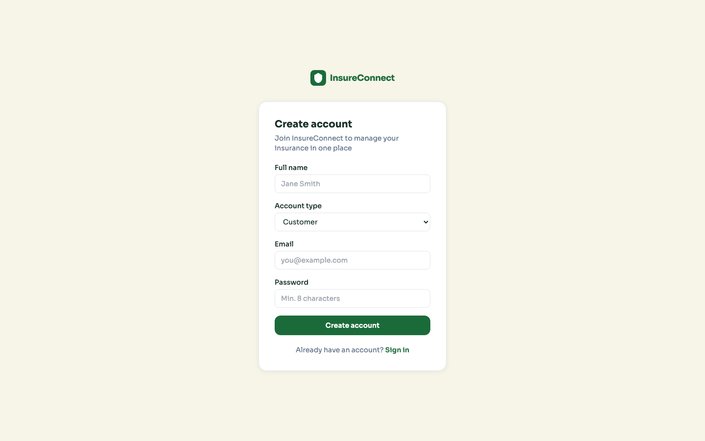

- File: [docs/screenshots/public/02-register.png](../screenshots/public/02-register.png)
- Demonstrates: account creation flow and onboarding UX.

### Admin Login
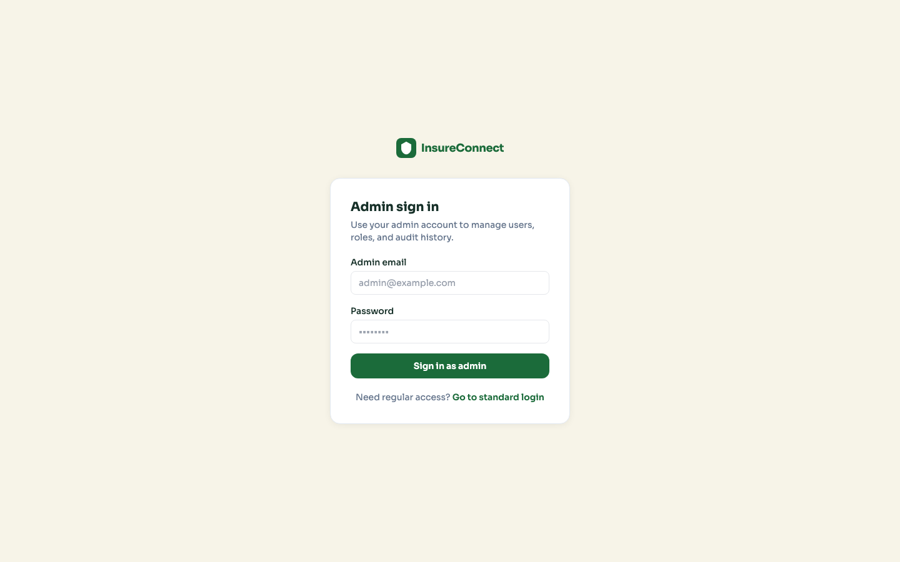

- File: [docs/screenshots/public/03-admin-login.png](../screenshots/public/03-admin-login.png)
- Demonstrates: isolated admin authentication entry point.

## Shared

### Self-Service Role Management
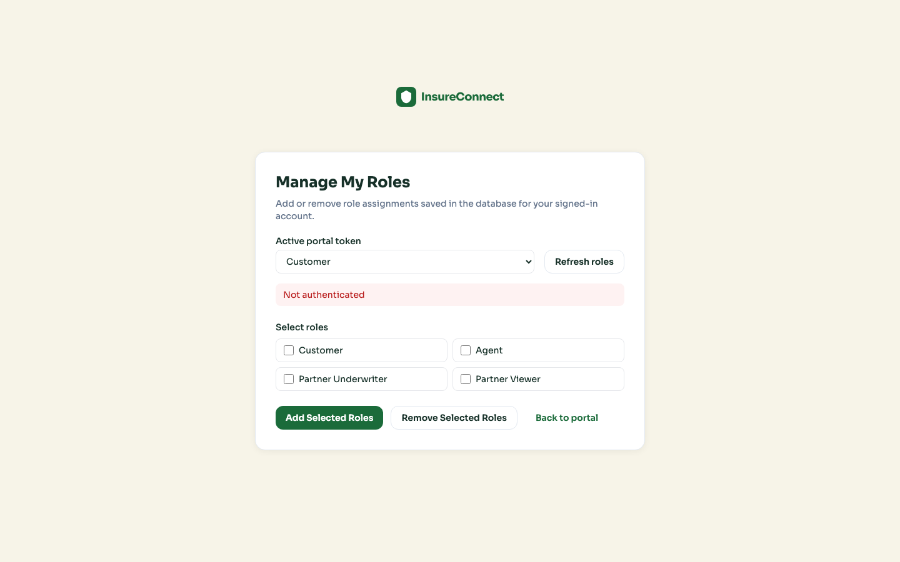

- File: [docs/screenshots/shared/01-role-management.png](../screenshots/shared/01-role-management.png)
- Demonstrates: multi-role account behavior and portal switching support.

## Customer

### Customer Dashboard
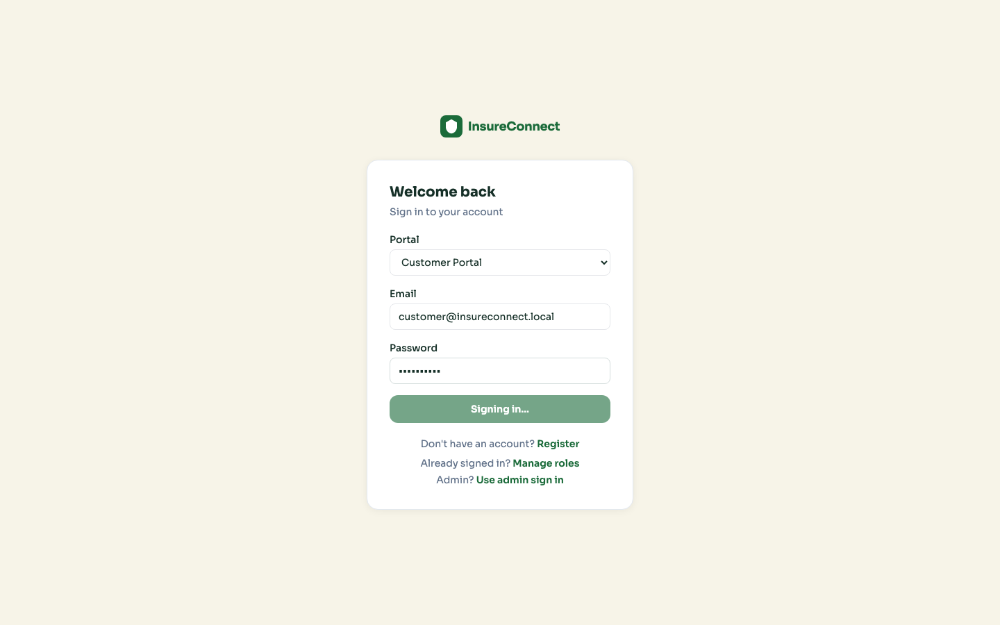

- File: [docs/screenshots/customer/01-dashboard.png](../screenshots/customer/01-dashboard.png)
- Demonstrates: customer landing experience and account-level summary.

### Customer Policies List

- File: [docs/screenshots/customer/02-policies-list.png](../screenshots/customer/02-policies-list.png)
- Demonstrates: policy visibility and list-level navigation.

## Agent

### Agent Dashboard
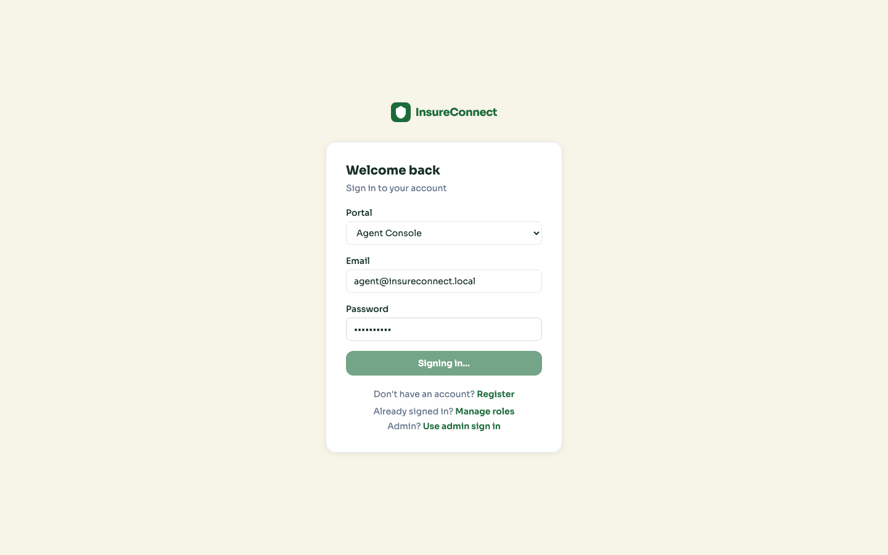

- File: [docs/screenshots/agent/01-dashboard.png](../screenshots/agent/01-dashboard.png)
- Demonstrates: assigned quote workload and performance indicators.

### Agent Quotes (All)
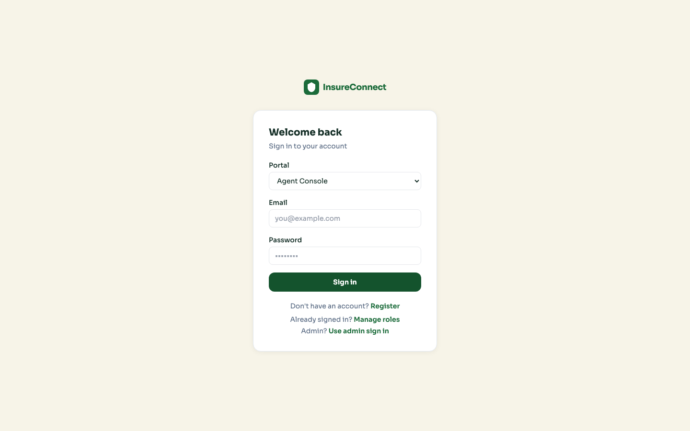

- File: [docs/screenshots/agent/02-quotes-all.png](../screenshots/agent/02-quotes-all.png)
- Demonstrates: full quote request queue and status distribution.

### Agent Quotes (Filtered Pending)
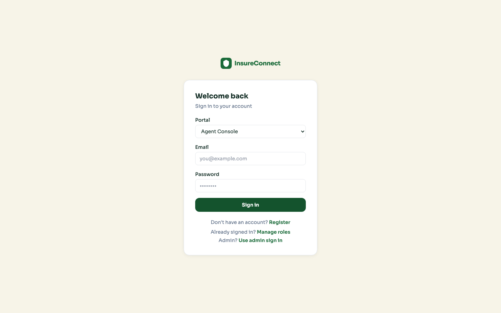

- File: [docs/screenshots/agent/03-quotes-filter-pending.png](../screenshots/agent/03-quotes-filter-pending.png)
- Demonstrates: working status filter behavior via URL parameter.

### Agent Policies List
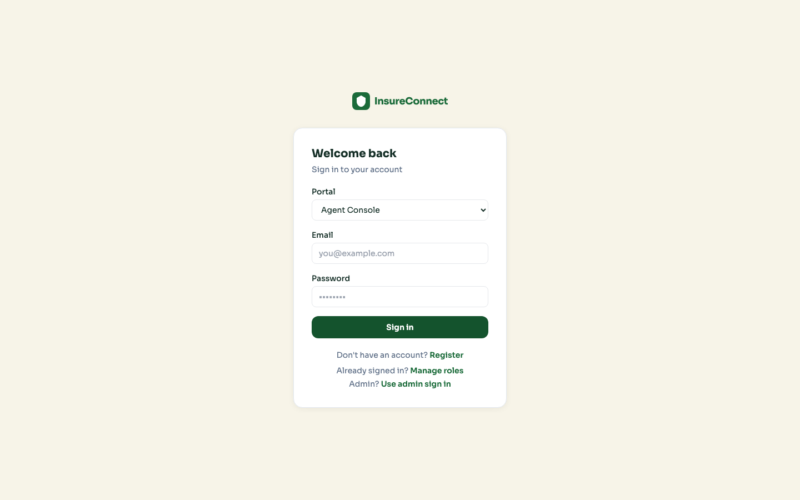

- File: [docs/screenshots/agent/05-policies-list.png](../screenshots/agent/05-policies-list.png)
- Demonstrates: policy portfolio view for agent workflows.

### Agent Policy Detail
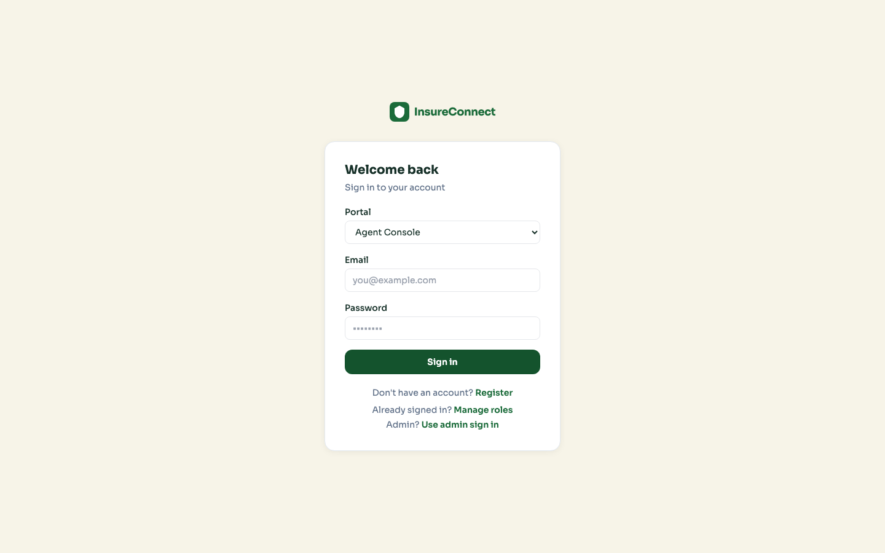

- File: [docs/screenshots/agent/06-policy-detail.png](../screenshots/agent/06-policy-detail.png)
- Demonstrates: corrected detail navigation and policy content rendering.

## Partner

### Partner Dashboard
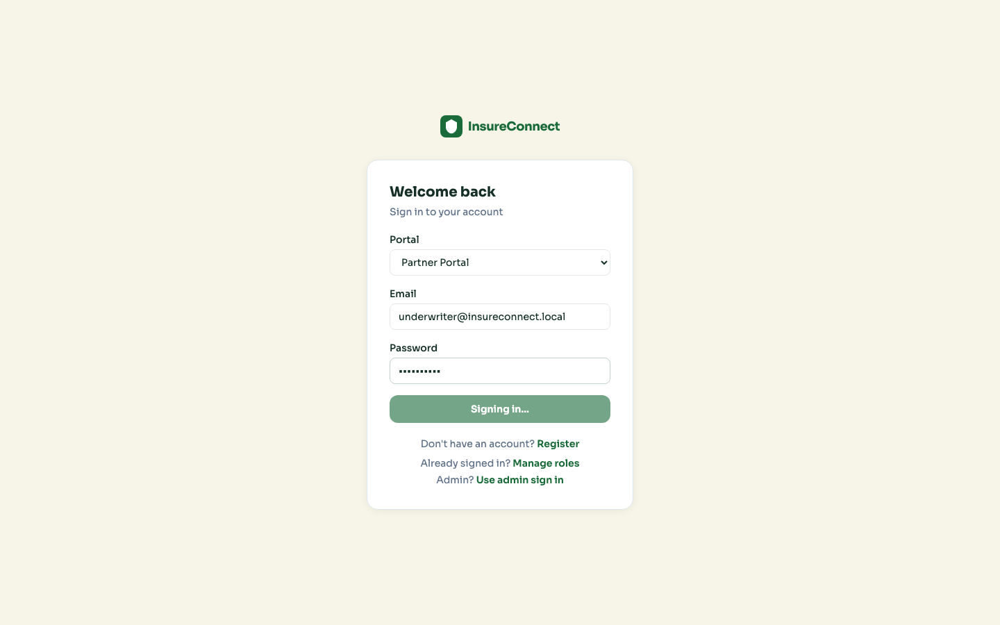

- File: [docs/screenshots/partner/01-dashboard.png](../screenshots/partner/01-dashboard.png)
- Demonstrates: integration KPIs and human-readable response-time metric.

### Partner Quotes
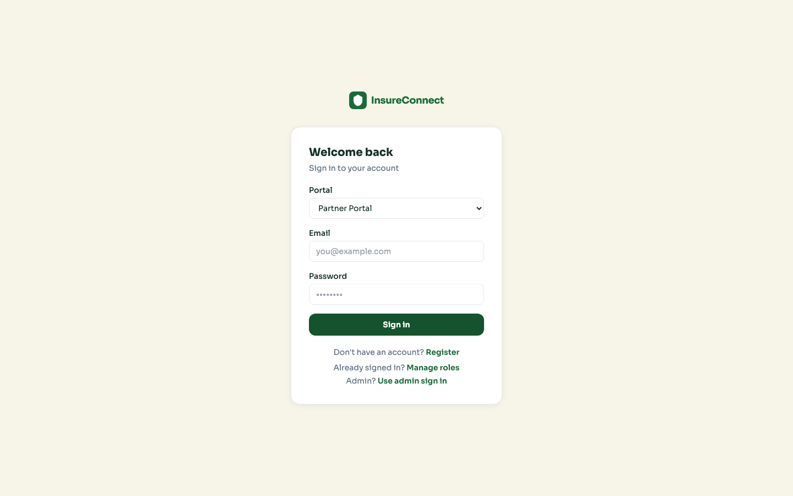

- File: [docs/screenshots/partner/02-quotes-list.png](../screenshots/partner/02-quotes-list.png)
- Demonstrates: partner quote traffic and carrier response snapshot.

### Partner Policies List

- File: [docs/screenshots/partner/03-policies-list.png](../screenshots/partner/03-policies-list.png)
- Demonstrates: partner policy portfolio listing.

### Partner Policy Detail

- File: [docs/screenshots/partner/04-policy-detail.png](../screenshots/partner/04-policy-detail.png)
- Demonstrates: corrected list-to-detail partner flow using portal-correct API path.

## Admin

### Admin Role Management

- File: [docs/screenshots/admin/01-role-management.png](../screenshots/admin/01-role-management.png)
- Demonstrates: operational role assignment and removal controls.

### Admin Audit Log

- File: [docs/screenshots/admin/02-audit-log.png](../screenshots/admin/02-audit-log.png)
- Demonstrates: governance trail for role actions (who changed what and when).

## Coverage Note

This catalog prioritizes high-impact application flows and role-based behaviors. If needed for a formal interview packet, extend with mobile viewport captures and per-component section captures for every dashboard card, table segment, and empty/error state.
